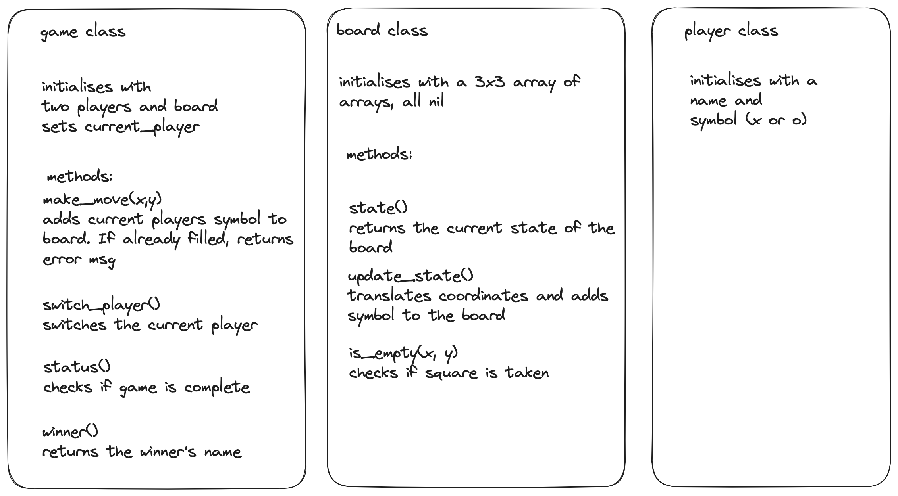

# Tic Tac Toe

A task to build the business logic for a game of tic tac toe which could easily be combined with with any user interface, whether web or command line.

## The brief

The rules of tic tac toe are as follows:

- There are two players in the game (X and O)
- Players take turns until the game is over
- A player can claim a field if it is not already taken
- A turn ends when a player claims a field
- A player wins if they claim all the fields in a row, column or diagonal
- A game is over if a player wins
- A game is over when all fields are taken

## Design

A three class design has been chosen:

Class design plan:


## Setup

```zsh
bundle install

# To get details tests and test coverage:
rspec
```

## Built with

#### Languages used:

- Ruby

#### Testing environment:

- RSpec

## Example

```ruby
// irb
require './lib/board.rb'
require './lib/player.rb'
require './lib/game.rb'

board = Board.new
player_1 = Player.new('Caz','X')
player_2 = Player.new('Pip','O')
game = Game.new(player_1,player_2,board)

game.make_move(2,2)
game.switch_player
game.make_move(1,1)
game.switch_player
game.make_move(1,2)
game.switch_player
game.make_move(2,1)
game.status # returns 'incomplete'
board.state # returns [[nil, nil, nil], ["X", "X", nil], ["O", "O", nil]]
game.winner # returns nil
game.switch_player
game.make_move(3,2)
game.status # returns 'complete'
board.state # returns [[nil, nil, nil], ["X", "X", "X"], ["O", "O", nil]]
game.winner # returns 'Caz'
```
